  

  

I build full-stack web applications and AI-powered tools, practise DSA in Java, and like turning real problems into software people can actually use.

 

## 👨‍💻 Developer Snapshot

| | |
|---|---|
| 🎓 **Education** | B.E. Computer Science & Engineering, KLE Institute of Technology, Hubballi (2024 – 2027) · CGPA 8.54 |
| 💻 **Focus** | Full-Stack Web Development · AI / Machine Learning |
| 🎯 **Target Roles** | Software Engineer · Full-Stack Developer · AI/ML Engineer |
| 🧠 **Primary Language** | Java |
| 🔤 **Languages** | Java · JavaScript · Python · SQL · C |
| 🌐 **Frontend** | HTML5 · CSS3 · React.js · Responsive Web Design |
| ⚙️ **Backend** | Node.js · Express.js · JSP · Flask · REST APIs |
| 🗄️ **Databases** | MySQL · MongoDB |
| 🤖 **AI / Machine Learning** | TensorFlow · YOLOv8 · OpenCV · Computer Vision · OCR · Image Processing |
| 📚 **Currently Improving** | Data Structures & Algorithms in Java |
| 📍 **Based in** | Hubballi, Karnataka, India |

 

## 🏆 Achievements

### 🥇 1st Place — NAIN 2.0 Graduation & Demo Day, IIIT Dharwad

**AI-Powered Assistive Technology for Visually Impaired Individuals (SmartVision)**

 

- **What I built:** an AI-powered assistive prototype that helps visually impaired users read text and identify nearby objects.
- **How it works:** OCR for both digital and handwritten text, Text-to-Speech output, and YOLOv8 for real-time object detection.
- **Design goals:** privacy, reliability and usability.
- **Program:** New Age Innovation Network (NAIN 2.0), Government of Karnataka · Sep 2025 – Mar 2026

`Tech: OCR · Text-to-Speech · YOLOv8 · Computer Vision`

---

### 🏆 2nd Runner-Up — HackArena 2K26

Jain College of Engineering & Technology

<b>Certifications</b>

 

- **Build Real World AI Applications with Gemini and Imagen** (Machine Learning & AI) — Google Cloud Skills Boost, 2025
- **Problem Solving Through Programming in C** — NPTEL, 2026
- **TCS iON Career Edge – Young Professional** — Tata Consultancy Services iON, 2025

 

## 💼 Experience

**Full Stack Development Intern** · Athreya Technologies, Hubballi, Karnataka 
January 2024 – April 2024

- Developed a full-stack web application using Java, JSP, HTML, CSS and MySQL.
- Implemented user authentication, cost estimation, dashboard and business insights modules.
- Built responsive UI components and debugged cross-browser compatibility issues in CSS and JavaScript.
- Used Git and GitHub for version control and collaborated with other developers on the application.

**Full Stack Development & Data Structures Trainee** · Apna College – Sigma 10, Online 
2025 – Present · ongoing training program

- Java, Data Structures & Algorithms, HTML, CSS, JavaScript, React, Node.js, Express.js and MongoDB.
- Practise DSA and problem solving through coding exercises and programming challenges.

 

## 🛠️ Tech Stack

| | |
|---|---|
| **Languages** |  Java · JavaScript · Python · SQL · C |
| **Frontend** |  HTML5 · CSS3 · React.js · Responsive Web Design |
| **Backend** |  Node.js · Express.js · JSP · Flask · REST APIs · API Integration |
| **Databases** |  MySQL · MongoDB |
| **AI / Machine Learning** |  TensorFlow · YOLOv8 · OpenCV · Computer Vision · OCR · Image Processing |
| **Tools** |  Git · GitHub · VS Code · Eclipse |

 

## 🧠 Problem Solving

- Practising Data Structures & Algorithms in Java.
- Comfortable with Object-Oriented Programming and debugging.
- Working through coding exercises and programming challenges regularly.

 

## 🌱 Currently

- Strengthening DSA and problem solving in Java
- Building full-stack applications with React, Node.js, Express.js and MongoDB
- Building AI-powered applications with Python, TensorFlow and OpenCV
- Completing my B.E. in Computer Science (graduating 2027)
- Preparing for Software Engineer, Full-Stack Developer and AI/ML Engineer roles

 

## 📈 GitHub Activity

 

## 🤝 Let's Connect

I'm open to conversations about software engineering, full-stack and AI/ML roles, internships and interesting projects.

